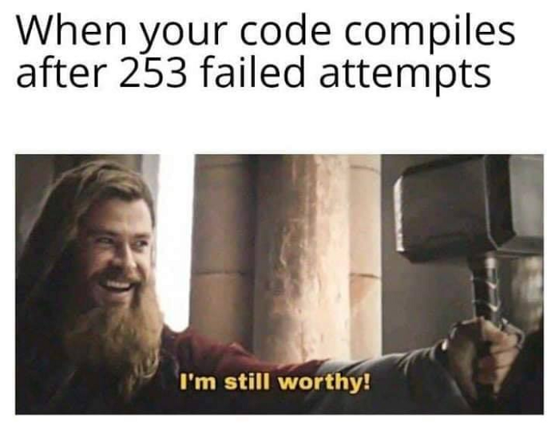

<h3 align="center">Hi there </h3>

I'm Tianqi Zhao

:school: <a href="https://www.columbia.edu">@Columbia University</a> Class of 2023

:man_technologist: @B.S. in Computer Science

  

- 🔭 I’m currently doing researching on Named Entity Recognition in the Natural Language Processing field
- 🌱 I’m currently learning Computational Neuroscience
- 👯 I’m looking to collaborate on C++ projects
- 🤔 I’m looking for help with C++, AWS, Azure, and Machine Learning
- 💬 Ask me about Node.js, MongoDB, Python, Java, and Firebase
- 😄 Pronouns: he/him/his
- ⚡ Fun fact: I'm currently reading *I Am A Cat* by Natsume Sōseki

---

### Learn More About Me

&emsp;

<h3>Contact Me</h3>

